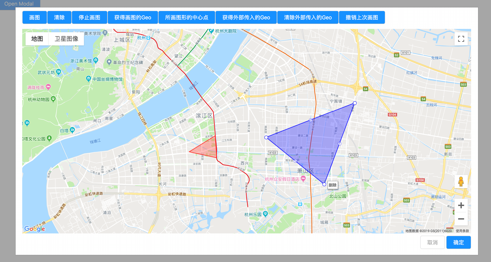
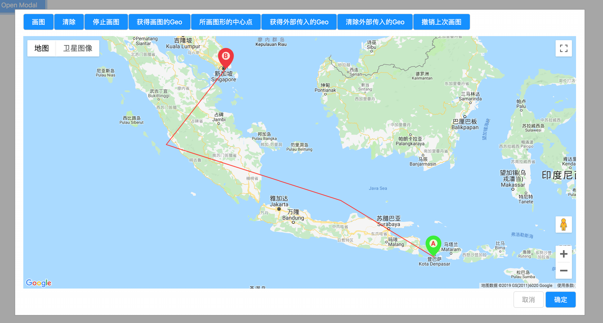

# Google Map js API(v3) Tool

## ScreenShot

edit or display or customization style





## API

specific google object options can be found on [Google Develop](https://developers.google.com/maps/documentation/javascript/reference/)

|props|default|type|descriptioin|
|:-|:-:|:-:|:-|
|loadMap| - |[`LoadMapOption`](#LoadMapOption)| init Google Map |
|startDrawing|-|`VoidFunction`| enable google map drawing js api|
|cleanDrawing|-|`VoidFunction`| stop google map drawing|
|cleanPolygons|-|`VoidFunction`| clean up displayed polygons|
|cleanRoutines|-|`VoidFunction`|clean up displayed routines|
|removeLastMarker|-|`VoidFunction`|remove last marker|
|undoLastDrawing|-|`VoidFunction`|undo last draw polygon|
|getMap|-|`()=>GoogleDrawManager`|get initialized google map instance or `false`|
|getDrawingManager|-|`()=>GoogleDrawManager`|get google map drawing manager or `false`|
|getDrawPoints| -|`()=>`[`PointArray`](#pointarray)|get draw polygons|
|getPolygonPoints|-|`()=>`[`PointArray`](#pointarray)|get edited or original passed in polygon points|
|cleanPolygons|-|`VoidFunction`|clean up polygons|
|getCenterPoints|-|`()=>LatLng/Array<LatLng>`|get draw polygon(s) center point(s) |
|checkPoint|-|`(LatLng)=>Boolean`|check target point within polygon|

### LoadMapOption

|props|default|type|descriptioin|
|:-|:-:|:-:|:-|
|API_KEY| - |`String`| google map js api key |
|map_options|`{ zoom: 4,center: { lat: 30.1959666, lng: 120.2137009 }}`|`GoogleMapOptions`| pass google map init options|
|node_name|-|`HTMLElement\String`| google map mount node or dom id string|
|polygon|-|[`Polygon`](#Polygon)| polygon option|
|routine|-|[`Routine`](#Routine)| routine option|
|on_load|-|`(err:String)=>void`|func runs after script loaded, `err` would be null if success|

### PointArray

```ts
Array<Latlng>|Array<Array<Latlng>>
```

### Polygon

`polygonOptions` is google map polygon option, if passing an array it will use the target option with same index of path array

```ts
{
    polygonOptions: Object|Array<Object>,
    polygonPaths: Array<LatLng> | Array<Array<LatLng>>
}
```

### Routine

```ts
{
    routineOptions: Object|Array<Object>,
    routinePaths: {
        from: LatLng,
        to: LatLng,
        path: Array<LatLng>
    }
}
```

## Examples

The project has include a simple example for the lib, as google map api has query limitation, you can replace your own `API_KEY` in [index.js](./index.js) and template in index.html.
